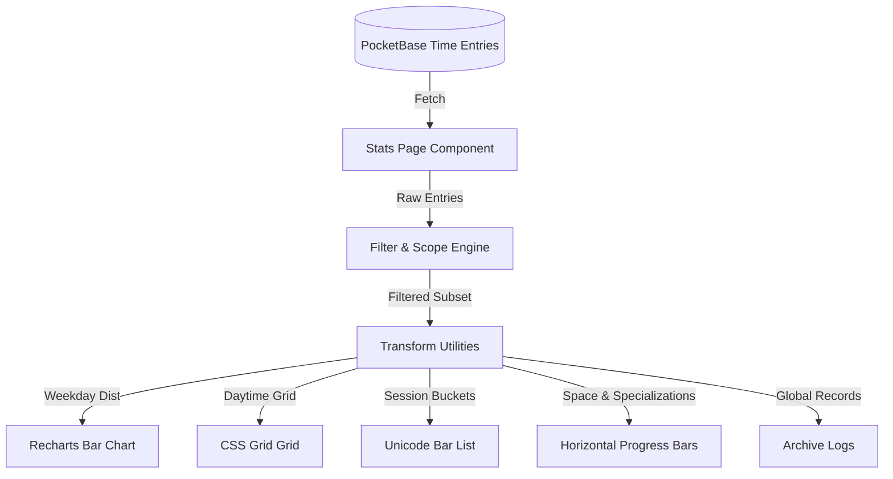

# Enriched Stats Page Design Specification

This document details the architecture, data transforms, and UI design for the enriched stats page in Qadrant.

## 1. System Architecture

The stats page architecture follows a pure functional pattern for data processing. All mathematical and aggregation logic is decoupled from rendering to ensure ease of testing, consistency, and performance.



---

## 2. Data Transformations (`src/lib/transform.ts`)

We implement the following functional transformations on completed `TimeEntry` records:

### 2.1 Scope & Filtering
Allows slicing the dashboard data. Computes local time bounds dynamically based on a target reference date.
- **Timeframes**:
  - `ALL_TIME`: Unfiltered.
  - `THIS_YEAR`: From January 1st of the current year.
  - `THIS_QUARTER`: From the start of the current quarter (Jan 1, Apr 1, Jul 1, Oct 1).
  - `THIS_MONTH`: From the 1st of the current month.
  - `THIS_WEEK`: From Monday of the current week.
- **Space Filtering**: Filters entries by matching `entry.space`. An option of `'ALL'` bypasses this filter.

### 2.2 Time-Shape Analysis
- **Weekday Distribution**: Sums duration hours grouped by local weekday (Monday to Sunday).
- **Daytime Heatmap (7x24)**: Allocates session duration minutes to the hour blocks they crossed. Spans midnight or multiple hour boundaries precisely.
- **Start Time Heatmap**: A simpler frequency distribution mapping session start times to 24 hourly buckets.
- **Session Length Buckets**: Groups completed session durations into buckets:
  - `0-15m`, `15-30m`, `30-60m`, `1-2h`, `2h+`.
- **Deep Work Ratio**: Percentage of completed sessions lasting $\ge 90$ minutes.

### 2.3 Space / Specialization Leaderboard
- **Space Distribution**: Aggregates hours per space, sorted descending.
- **Specialization Distribution**: Inside a selected space, aggregates hours per specialization.
- **Ranked Leaderboard**: List of top 10 specializations with total hours and days since the last entry.
- **Pareto Bar Chart**: Displays cumulative hours across spaces with a cumulative percentage line overlay.

### 2.4 Comparison & Baseline Metrics
- **Rolling Average**: The overall daily average hours across the current 30-day window to draw a baseline line.
- **Week-over-Week Practice Volume**: Compiles total weekly hours for the current week and the 7 preceding weeks.
- **Delta Annotations**: Compares the current timeframe's stats (e.g. total hours, active days) to the previous period of the same duration.

### 2.5 Archive Records & Milestones
- **Global Records**: Calculates global best day, longest streak, and top space ever recorded.
- **Days Since Record**: Finds the number of days elapsed since the global records were set.
- **Milestones**: Computes achievements including total hours logged in specific spaces, total sessions completed, and maximum streak reached.

---

## 3. UI Component Details

### 3.1 Filters Section
- **Scope Capsule Control**: Button list of timeframe scopes. Active button gets filled style `.btn--filled`.
- **Space Dropdown**: A dropdown select matching the input element styling to choose the active space.
- **Comparison Checkbox**: A checkbox to toggle the `// DELTA_ANNOTATIONS` state.

### 3.2 Stage Drop Header
Displays the Mastery Index. If filters are active, the eyebrow reflects the active space and timeframe constraints (e.g. `▸ MASTER_INDEX // SCOPE: WORK / THIS_MONTH`).

### 3.3 Insight Cards Row
- **Today Playtime**: Value + delta annotation (e.g. `Δ -2h 14m vs last period`).
- **Streak**: Consecutive active days.
- **Best Day**: Maximum hours logged in a single day + label showing days since set.
- **Deep Work Ratio**: The percentage of sessions $\ge 90$ minutes.

### 3.4 Interactive Visual Charts
- **Weekday Distribution**: Recharts `<BarChart>` using `--accent` color fill.
- **Daytime Heatmap**: A CSS grid (7 rows × 24 columns). Intensity scale:
  - 0 min: Transparent border
  - 1-15 min: `--accent-mute`
  - 16-45 min: `--accent-soft`
  - 46+ min: `--accent`
- **Session Length Buckets**: Monospaced listing with Unicode bars:
  ```text
  0-15m   ████░░░░░░ 40% (8 sessions)
  15-30m  ██████░░░░ 60% (12 sessions)
  ```
- **Ranked Leaderboard**: Hairline table rows showing top specializations.

---

## 4. Test Strategy

1. **Unit Testing (`transform.test.ts`)**:
   - Write unit tests for all new calculations in `transform.ts` using Vitest.
   - Assert correct timezone boundary logic for quarters, years, and weeks.
   - Verify precise daytime minute allocation across hour boundaries.
2. **Visual Checks**:
   - Run Vite development server and verify rendering on mobile and desktop layout dimensions.
